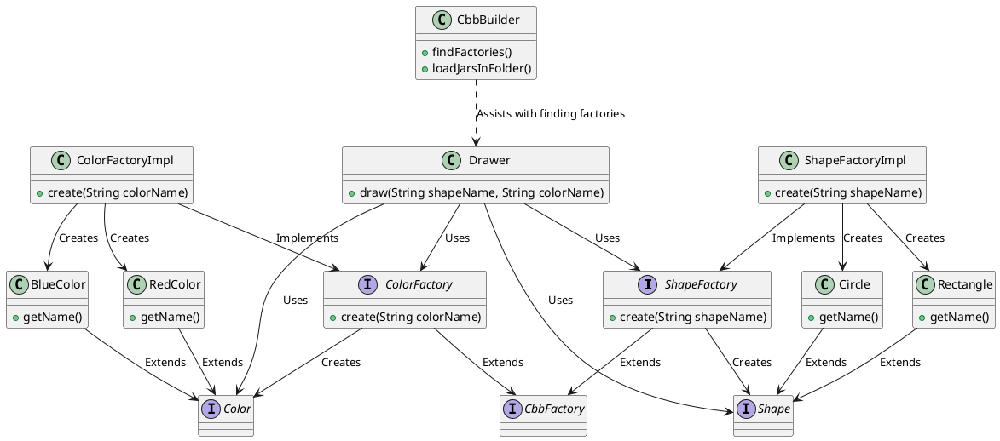

# 项目概述

本文档解释了 **Drawer** 类如何与项目的其余部分进行交互，重点关注接口、动态 JAR 加载和模块化。

## UML 图

下图说明了 **Drawer** 类及其依赖关系：

### 关键点：

1. **Drawer 只引用接口**：

   - `Drawer` 类只与 **接口** (`ShapeFactory`, `ColorFactory`) 交互，而不是具体的实现类。这对于项目的模块化设计至关重要。
   - `Drawer` 类调用这些工厂的 `create()` 方法，而不需要知道使用的具体实现。

2. **新增的实现类 JAR 文件**：

   - 包含 `ShapeFactory` 或 `ColorFactory` 实现的新 JAR 文件可以直接复制到 `libs` 文件夹中。
   - 新增实现时，不需要修改 `Drawer.java`。`CbbBuilder` 类会在运行时从 `libs` 文件夹中动态加载新实现。

3. **模块化、独立开发**：

   - 每个实现（如 `ShapeFactoryImpl` 或 `ColorFactoryImpl`）可以 **独立修改**，无需了解其他实现。
   - 这意味着不同的团队或开发者可以 **并行** 工作，不会产生冲突。
   - 每个实现都封装在自己的 JAR 文件中，方便替换或升级而不影响系统的其他部分。

4. **`CbbBuilder.java` 如何工作**：
   - `CbbBuilder` 类负责 **动态加载 JAR 文件** 并查找工厂的实现。
   - **简要步骤**：
     1. 扫描 `libs` 文件夹中的 JAR 文件。
     2. 使用 `URLClassLoader` 动态加载这些 JAR。
     3. 查找实现了所需接口（如 `ShapeFactory`, `ColorFactory`）的类。
     4. 这些实现被实例化并传递给 `Drawer` 使用。
   - 这种方式使 `Drawer` 类和工厂实现之间实现了 **松耦合**。

### 附加说明：

- 该架构支持 **扩展性**，可以在不改变核心逻辑的情况下添加新的形状或颜色实现。
- 没有对实现类（`Impl` 类）的 **直接依赖** 确保了系统的灵活性和模块化。
