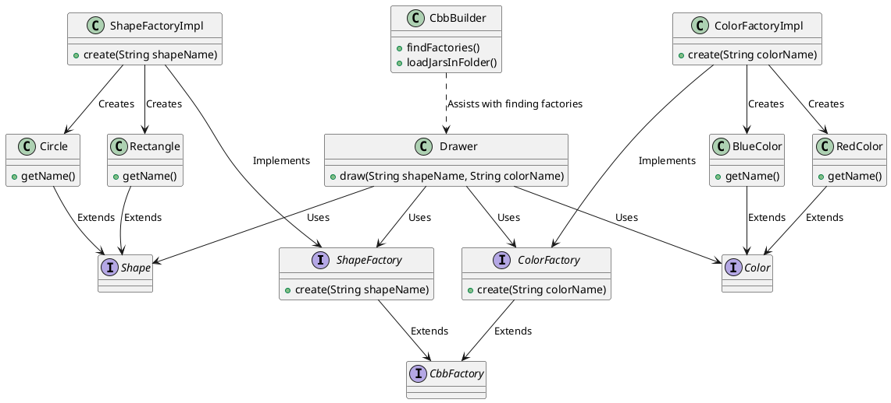

# Project Overview

This document explains how the **Drawer** class interacts with the rest of the project, focusing on interfaces, dynamic JAR loading, and modularity.

## UML Diagram

The diagram below illustrates the relationship between the **Drawer** class and its dependencies:

### Key Points:

1. **Drawer Refers Only to Interfaces**:

   - The `Drawer` class only interacts with the **interfaces** (`ShapeFactory`, `ColorFactory`) rather than concrete implementation classes. This is crucial for the modular design of the project.
   - The `Drawer` class calls `create()` on these factories without needing to know which specific implementation is used.

2. **New Implementation JAR Files**:

   - New JAR files containing implementations of `ShapeFactory` or `ColorFactory` can be **copied** directly to the `libs` folder.
   - No modification to `Drawer.java` is necessary when new implementations are added. The `CbbBuilder` class dynamically loads the new implementations at runtime from the `libs` folder.

3. **Modular, Independent Development**:

   - Each implementation (such as `ShapeFactoryImpl` or `ColorFactoryImpl`) can be **modified separately** without requiring any knowledge of other implementations.
   - This means different teams or developers can work on different factory implementations in **parallel** without conflicts.
   - Each implementation is encapsulated within its own JAR file, making it easy to swap or upgrade without affecting the rest of the system.

4. **How `CbbBuilder.java` Works**:
   - The `CbbBuilder` class is responsible for **dynamically loading JAR files** and finding factory implementations.
   - **Brief Steps**:
     1. It scans the `libs` folder for JAR files.
     2. It loads these JARs dynamically using `URLClassLoader`.
     3. It finds classes that implement the required interfaces (`ShapeFactory`, `ColorFactory`).
     4. These implementations are instantiated and passed to `Drawer` for use.
   - This approach allows for **loose coupling** between the `Drawer` class and the factory implementations.

### Additional Notes:

- The architecture promotes **extensibility**, where new shape or color implementations can be added without any changes to the core logic.
- **No direct dependencies** on implementation classes (`Impl` classes) ensure that the system remains flexible and modular.
